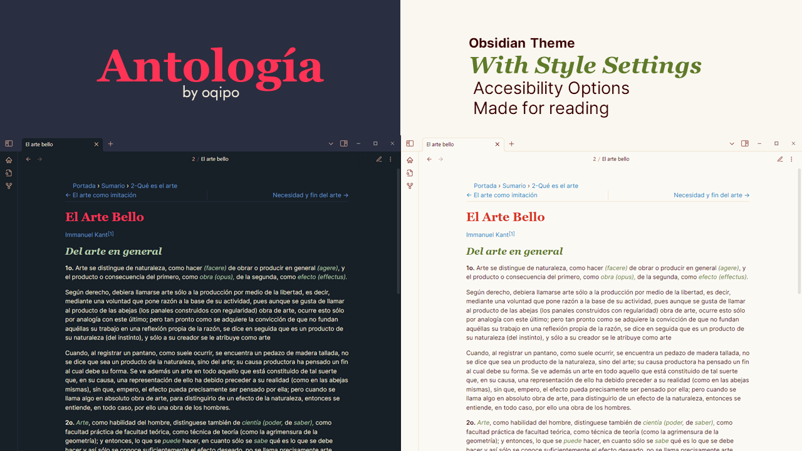

# Antología Theme

An Obsidian theme, made for reading.



Antología is an adjustable theme that offers some legibility and accesibility improvements.

## Features

- Subtle format highlighting
- High contrast selection
- Image filters (Described below)

Options (disabled by default) include:

- Font-combo presets
- Extended spacing
- Justified text
- Fixed line width

General enhancements:

- More consistent styling
- Breadcrumbs plugin enhancements

## Image filters

To use a filter add its name in the source:

```
[[image.png#filter_name]]
```

or

```
[image](imgsrc.png#filter_name)
```

There's **2** filter types and **4** image filters:

<!-- TODO Add example screenshots -->

- `diagram`: Use for black-and-white diagrams. Same as `diagramB`
	- `diagramB`: **Black** diagram over white background
	- `diagramW`: White diagram over **black** background
- `invert`: Use to invert values of an image. Same as `invertB`
	- `invertB`: Image has **dark** content over light background
	- `invertW`: Image has light content over **dark** background

<!-- Maybe add center property sometime later -->